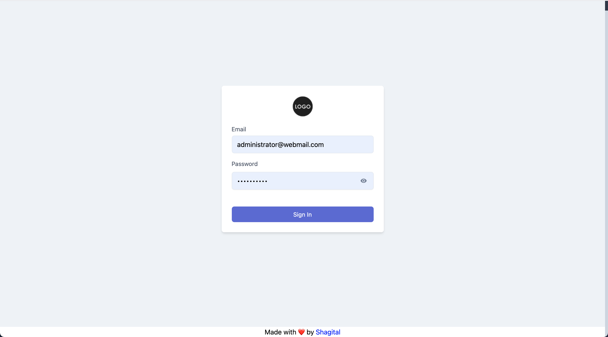
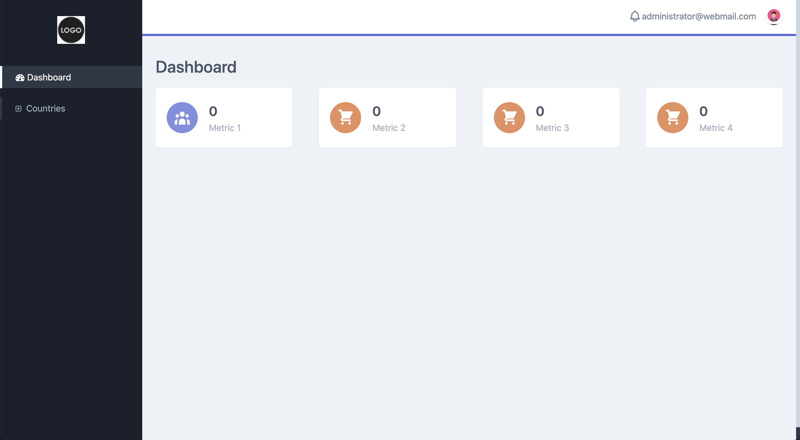
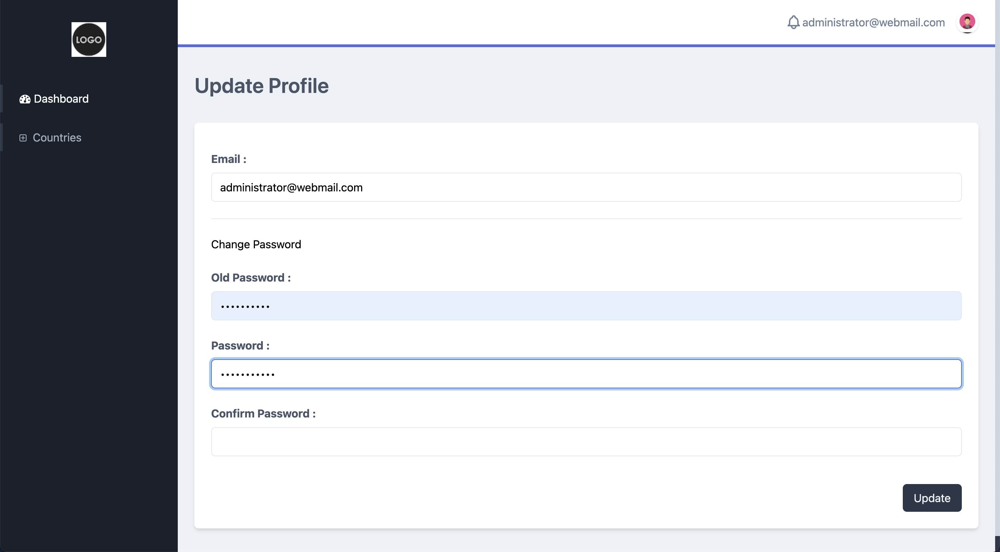
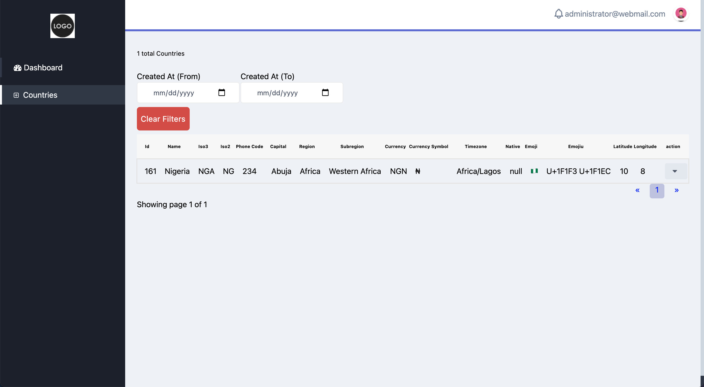
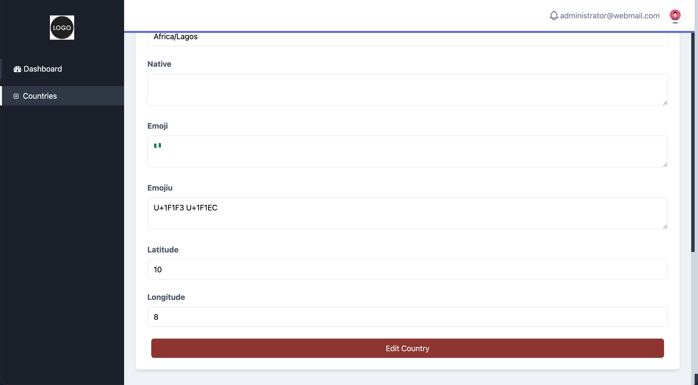

# AdonisJS CRUD Generator


This package allows you easily generate admin dashboard for your existing [AdonisJS](https://adonisjs.com/) app. The package generates the following:
- Migrations
- Controllers
- Model
- Routes
- Views

## Currently Supported
- MySQL
- PostgreSQL
- SQLite

## Requirements
- Adonisjs v4
- Node >=8
- Mysql >=5
- PostgreSQL >=10

## Dependencies
- [Adonis ACL](https://github.com/enniel/adonis-acl) for role and permission management

## Installation

You can install the package via NPM:
``` bash
npm install @shagital/adonisjs-crud-generator
```
Or with yarn
``` bash
yarn add @shagital/adonisjs-crud-generator
```

## Setup
- Run `adonis acl:setup` to create role permission migrations if you've not already done that
- Run `adonis crud:init` to generate default files for admin panel.
- Default admin password will be shown to you when the command is done. Copy it somewhere for login. In case you forget or need to change it, you can open `database/migrations/admin_default_role_permission.js` to see the password. You can also change password after login
- Update `config/crudGenerator` to specify admin model
- Add role&permission traits to admin User model:
```
static get traits () {
    return [
      '@provider:Adonis/Acl/HasRole',
      '@provider:Adonis/Acl/HasPermission'
    ]
  }
```

- `adonis key:generate` to generate App key
- Configure authentication
##### To use API:
- Open `config/auth.js` and change authenticator to `jwt`
- Open `config/shield.js`. Under csrf section, set enable to `false`
##### To use views:
- Open `config/auth.js` and change authenticator to `session`
- Open `config/shield.js`. Under csrf section, set enable to `true`
- Don't forget to uncomment the view codes in the generated controller files

##
- Open `start/kernel.js` and make sure `'Adonis/Acl/Init'` is in the globalMiddleware array
- In `start/kernel.js`, add the following to `namedMiddleware`:
```
is: 'Adonis/Acl/Is',
can: 'Adonis/Acl/Can',
requestType:'App/Middleware/RequestTypeMiddleware'
``` 
- In `start/app.js`, make sure the following exists in `providers` array:
```
'adonis-acl/providers/AclProvider',
'@adonisjs/validator/providers/ValidatorProvider'
```
- In `start/app.js`, add the following to alias array:
```
Role: 'Adonis/Acl/Role',
Permission: 'Adonis/Acl/Permission',
```
- In `start/app.js`, add the following to `commands` array:
```
'@shagital/crud-generator/src/Commands/CrudInitCommand',
'@shagital/crud-generator/src/Commands/CrudGeneratorCommand',
'@shagital/crud-generator/src/Commands/PermissionMigrationGeneratorCommand',
'@shagital/crud-generator/src/Commands/ControllerGeneratorCommand',
'@shagital/crud-generator/src/Commands/ModelGeneratorCommand',
'@shagital/crud-generator/src/Commands/ViewGeneratorCommand',
```
- The default admin email is `administrator@webmail.com`. You can change the email before running migration
- Run migration `adonis migration:run` to create admin user and set up roles and permissions
- Start your adonis app `adonis serve`
- Cd to the vue app directory `cd /resources/views/admin`
- Run `npm install` or `yarn install` to install dependencies
- At this point, your admin dashboard should be ready to use
- Run `npm run dev` or `yarn dev` to start the admin app in development mode
- You should be able to change your password after successful login

## Usage
To generate CRUD management for table `regions`, run `adonis crud:generate regions` and the following will be created
- Controller `app/Controllers/Http/Admin/RegionController`
- `start/routes.js` file will be updated with new routes
- `Region` model will be created with appropriate relationships, getters, setters and hooks
- A migration file will be generated to add new permissions for the admin
- Vue files will be generated and sidebar will be updated with new links

Navigate to your app and you should see the Region menu on the sidebar

## Available Commands
- `adonis crud:controller tableName`: This creates controller file and route
- `adonis crud:model tableName`: This creates model file with relationships
- `adonis crud:permission tableName`: This creates migration file for crud permissions
- `adonis crud:view tableName`: This creates vue files
- `adonis crud:init tableName`: This runs all of the above commands

## Options
- `--connection`: This option allows you specify which DB connection to use for the command e.g
`adonis crud:controller tableName --connection=sqlite`
>NB: The connection must have been defined in `config/database.js`

- `--migrate`: This option is available for the `crud:generate` and `crud:permission` commands. It tells the system to automatically run the migration after creation.
- `--prefix`: This option is available when initialising the CRUD with `crud:init`. It allows you specify a prefix for the admin endpoints that'll be created. If not specified, the system generates a random prefix

## Production
Run `npm run build` or `yarn build`
- Your view app should be available on `http:<BASE_URL>/admin`

>Note: In running the commands, if you don't have adonis CLI installed globally, you can use `node ace` instead. For example, to generate CRUD for table posts, run `node ace crud:generate posts`

## Error
If an error occurs while executing any of the command, it'll crash. Simply check your log to find out what went wrong - likely a file/directory permission issue, then run the command again.
>Note: Except otherwise stated, the commands always overwrite existing files (with same name)

## Screenshots










## Todo
- Add tests
- Add support for React

## Contributing
If you have a feature you'd like to add, kindly send a Pull Request (PR)

## Security
If you discover any security related issues, please email [zacchaeus@shagital.com](mailto:zacchaeus@shagital.com) instead of using the issue tracker.

## Credits
- [Zacchaeus Bolaji](https://github.com/djunehor)
- [All Contributors](../../contributors)

## License
The MIT License (MIT). Please see [License File](LICENSE.md) for more information.
